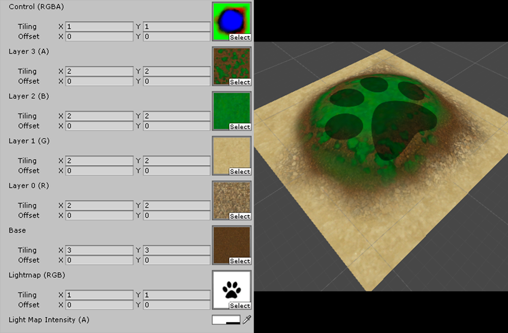

# Unity Shaderlab cg/hlsl
Sample shaders written for Unity

## Unlit Layered Lighmapped Shader

Layer masking controlled by the individual channels of an RGBA **"splat"** map. 
Lightmap intensity controlled by the **"Lightmap Intensity"** color swatch's alpha.
Sample splat PSD map can be painted out of 3dsMax using **Viewport Canvas**. 
Once painted, it can be converted in Photoshop using the **splat_converter.jsx** script in the **Photoshop** folder.

